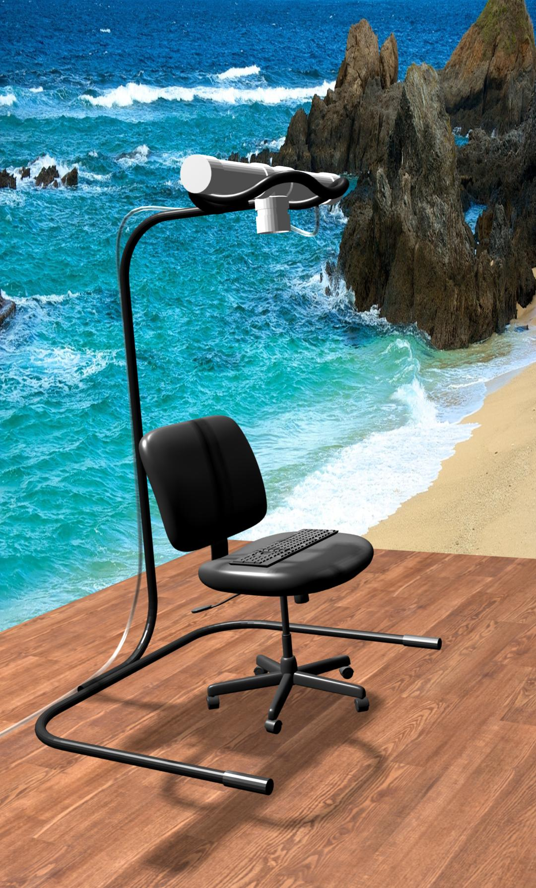

# climate-simulating-air-dispenser
An air dispenser for climate simulation.

My motivation for building the climate simulating air dispenser is the Midwest climate. The atmosphere is constantly changing and can become uncomfortable at times. The dispenser is intended to be used with exercise equipment (a hypoxicator and an oxygen concentrator). I believe this is new territory and should be explored carefully.
