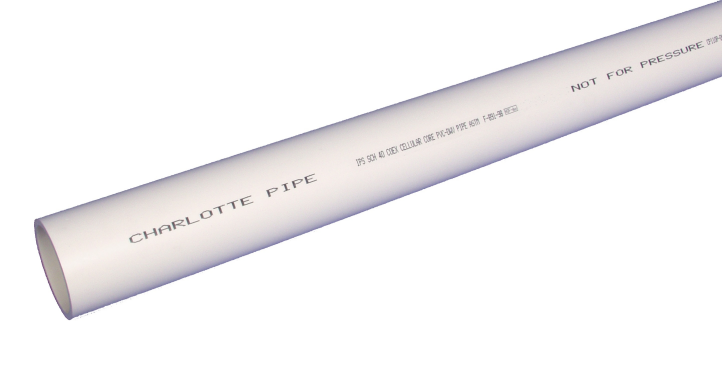
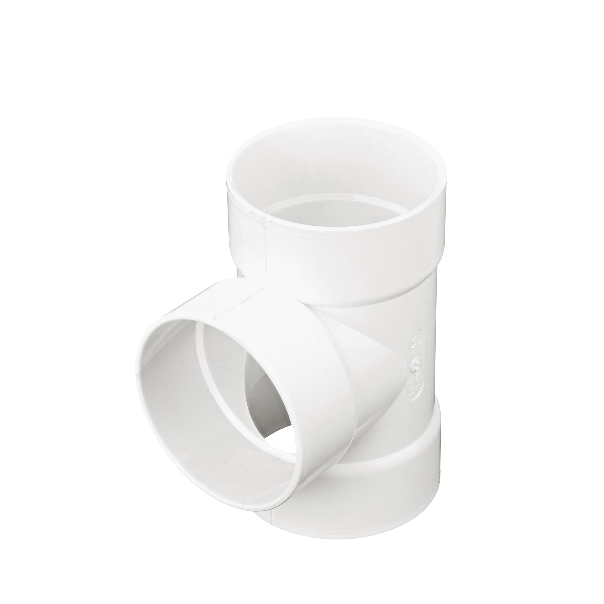
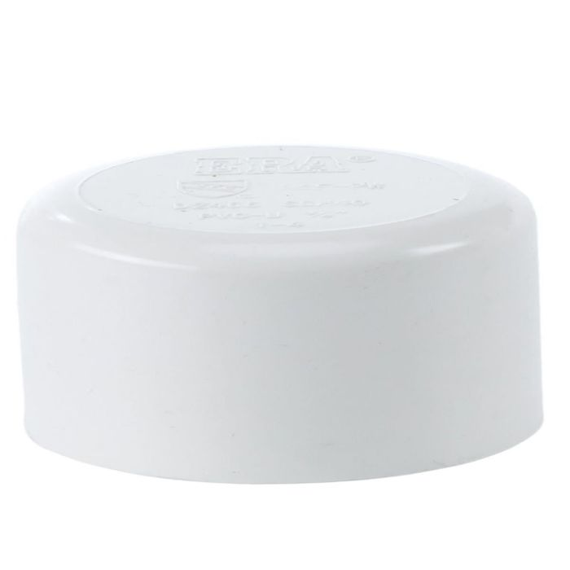
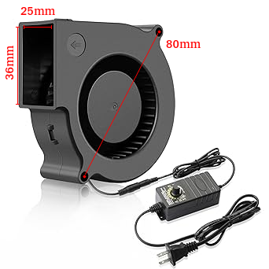
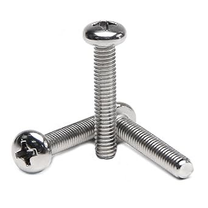

**1) 3 in. x 2 ft. PVC Pipe**  

---

**2) 3 in. PVC Pipe Tee Fitting**  

---

**3) 3 in. PVC Pipe End Cap -- x2**  

---

**4) 10 ft. 10mm ID, 13mm OD Silicone Tubing**  

---

**5) Blower Fan**  
Depicted: 12 volt Wathai 75mm x 30mm Blower Fan Dual Ball  

---

**6) 2 count M4x38, 4 count M4x20 screws**

