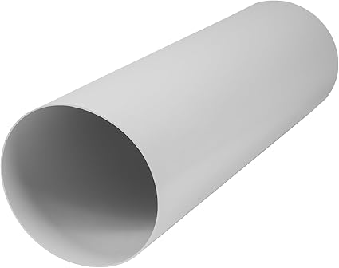
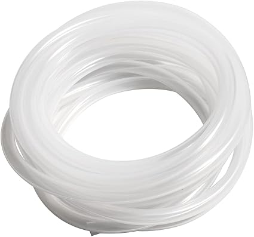
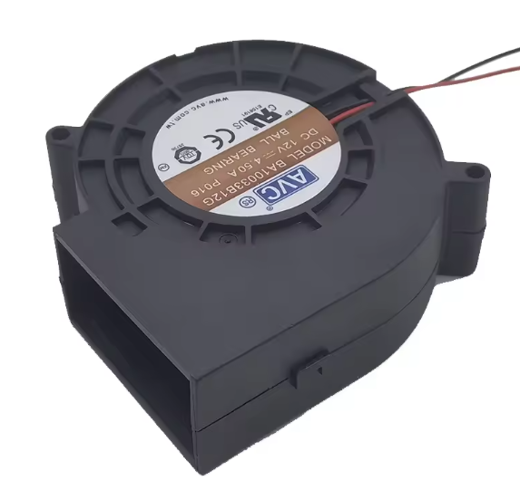
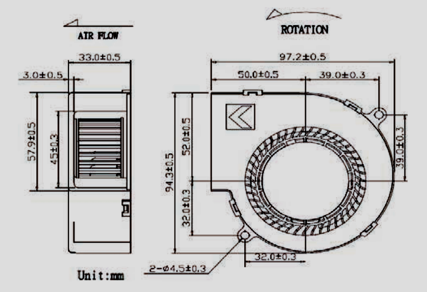
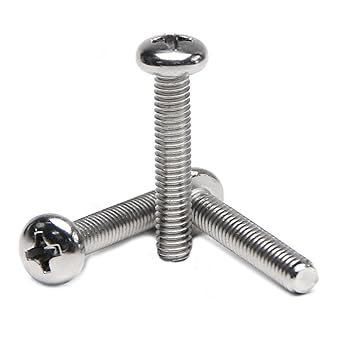

**1) 4 in. Diameter, 20 in. Ventilation Duct**  

---

**2) 10 ft. 10mm ID, 13mm OD Silicone Tubing**  

---

**3) Blower Fan**  
Depicted: AVC BA10033B12G  

---

**4) 2 count M4x70, 4 count M4x20 screws**  

