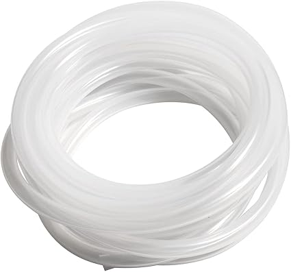

**1) 4 in. Diameter, 20 in. Ventilation Duct**  

---

**2) 10 ft. 10mm ID, 13mm OD Silicone Tubing**  

---

**3) Blower Fan**  
Depicted: AVC BA10033B12G  

---

**4) 3V-12V 5A 60W Adjustable Power Supply (5.5mm x 2.1mm compatible)**  

---

**5) 5.5mm x 2.1mm Female Power Plug Cable**  

---

**5) Quick Connect Terminal**  

---

**5) 2 count M4x70, 4 count M4x20 screws**  

---

**6) Cut-to-Fit Air Filter**  
NOTE: The filter needs to be impervious enough; otherwise, air will escape from the intake.  

---

---

**7) Adhesive Rubber Bumpers**  

